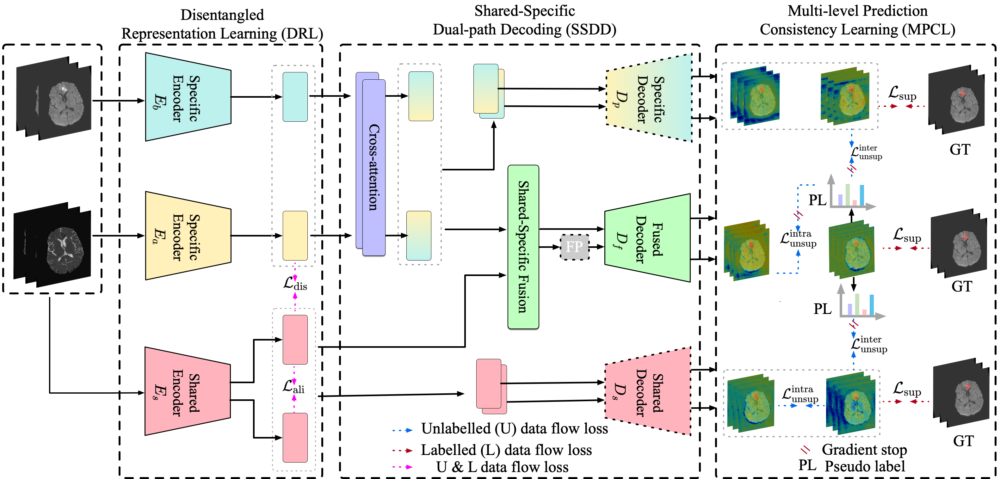
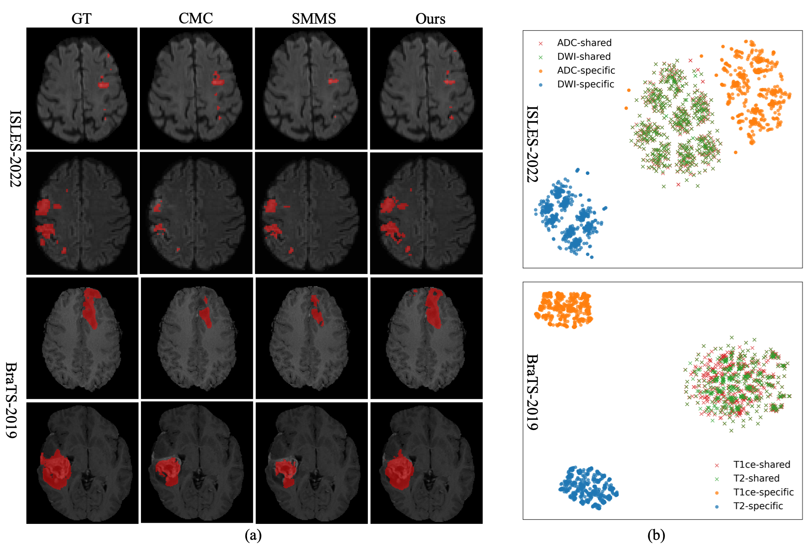

# HDCL
[](https://miccai.org/)
## News
#### Great news! Our paper has been early accepted (top 9%) to [MICCAI 2026](https://conferences.miccai.org/2026/en/default.asp)! 🎉

## Overview

This repository contains the code for **"Hierarchical Disentangled Consistency Learning for Semi-Supervised Multi-Modal Medical Image Segmentation"**! 



## Abstract
Semi-supervised learning (SSL) has achieved promising results in medical image segmentation by leveraging unlabeled data via consistency regularization. However, in multi-modal settings, heterogeneous modality characteristics and imbalanced reliability make effective consistency learning challenging. Existing methods typically impose prediction- or representation-level consistency on entangled features, which may suppress modality-specific cues and limit the exploitation of complementary cross-modal information in unlabeled data. To address this limitation, we propose HDCL, a hierarchical disentangled consistency learning framework to promote reliable and robust semi-supervised multi-modal medical image segmentation. Specifically, Disentangled Representation Learning (DRL) explicitly decomposes multi-modal features into shared and modality-specific representations, enabling targeted modeling of invariant semantics and modality-specific cues. We then propose Shared-Specific Dual-path Decoding (SSDD), which simultaneously decodes shared, specific, and fused representations to produce diverse modality-conditioned predictions. Furthermore, Multi-level Prediction Consistency Learning (MPCL) is proposed to enforce prediction consistency across different semantic spaces, allowing more effective utilization of unlabeled data without compromising modality-specific characteristics. Extensive experiments on two benchmarks demonstrate that our method consistently outperforms existing methods across different annotation settings.

## Dataset
The method is validated on two public datasets, including:

- [**BraTS-2019**](https://cecas.clemson.edu/~ahoover/stare/): Brain tumor segmentation. 
- [**ISLES-2022**](https://www.isles-challenge.org/): Stroke lesion segmentation. For data preprocessing and train/valid split, please refer to [github](https://github.com/pashtari/factorizer-isles22.git).


## Usage
### Installation

```
# environment requirements
pip install -r requirements.txt
```

### Training/Testing

```bash
bash ./scripts/train_brats19.sh train
bash ./scripts/train_brats19.sh val
```

## Results


## Citation
Please cite the following paper if you use this repository in your research.
```
will be updated later

```

## Contact
For any questions, feel free to contact: `feixiang.zhou.ai@gmail.com`
